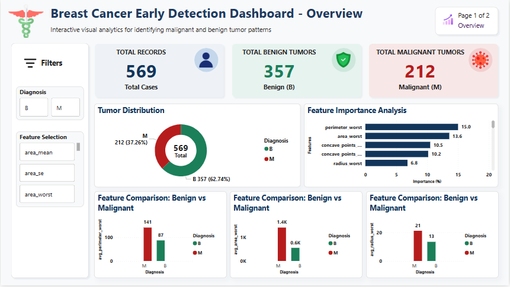
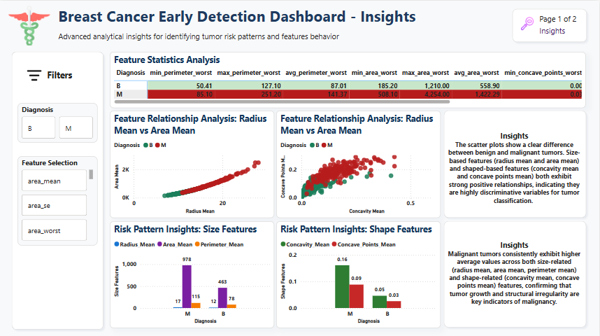
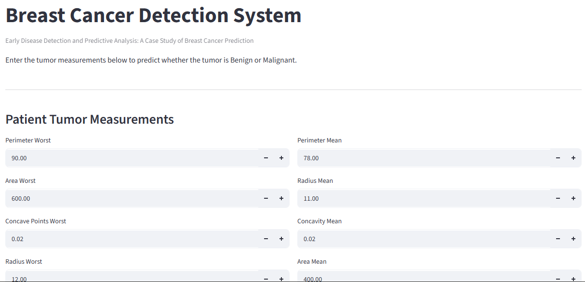
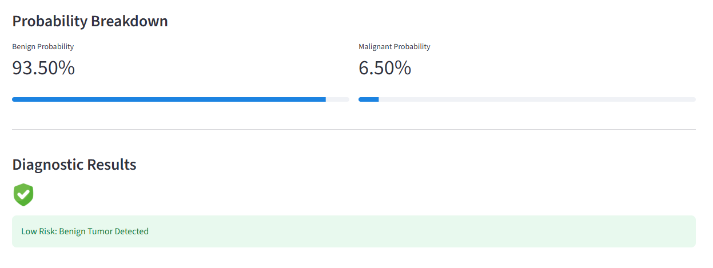
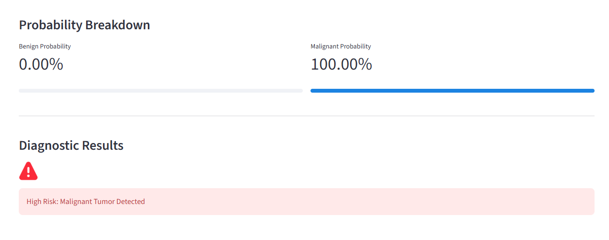

# Breast Cancer Early Detection

## Project Overview

This project analyzes breast cancer data to explore patterns in the dataset and develop a machine learning model for early disease prediction.

The project covers exploratory data analysis, data preparation, feature importance analysis, SQL analysis, machine learning, Power BI visualization, and an interactive prediction application.

## Objectives

- Explore breast cancer data and identify patterns within the dataset.
- Clean and prepare the dataset for analysis and prediction.
- Use SQL to analyze the data and create useful views.
- Identify important features associated with the prediction model.
- Develop a machine learning model for breast cancer prediction.
- Create a Power BI dashboard to present key findings and insights.
- Develop an interactive application for making predictions using the trained model.

## Tools & Technologies

- Python
- Pandas
- NumPy
- Matplotlib
- Seaborn
- SQL
- Power BI
- Scikit-learn
- Streamlit
- Jupyter Notebook

## Project Files

| File | Description |
|---|---|
| `Breast cancer analysis eda` | Exploratory data analysis and visualization |
| `Cancer prediction ml` | Machine learning analysis and prediction |
| `Breast cancer cleaned full` | Cleaned dataset used for analysis |
| `Feature importance.csv` | Feature importance results from the predictive model |
| `Early disease sql` | SQL queries and analytical views |
| `Breast cancer dashboard` | Power BI dashboard presenting key insights |
| `Scaler.pkl` | Saved feature scaling object used by the prediction model |
| `Breast cancer model.pkl` | Trained machine learning model |
| `Cancer detection app.ipynb` | Notebook used for developing the prediction application |
| `App.py` | Python application for interactive cancer prediction |

## Key Areas of Analysis

The analysis focuses on exploring patterns within breast cancer data, understanding important predictive features, and developing a machine learning model for early disease prediction.

## Project Outcome

The project combines data analysis, SQL, machine learning, visualization, and application development to explore breast cancer patterns and demonstrate how predictive analytics can be used to support early disease detection.

## Dashboard Preview

### Dashboard Page 1

### Dashboard Page 2

## Application Preview

### Cancer Detection App — Page 1

### Cancer Detection App — Page 2

### Cancer Detection App — Page 3

